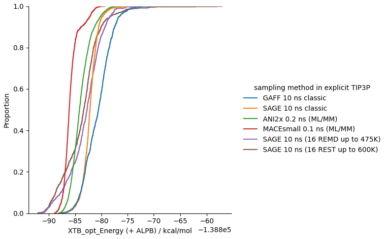
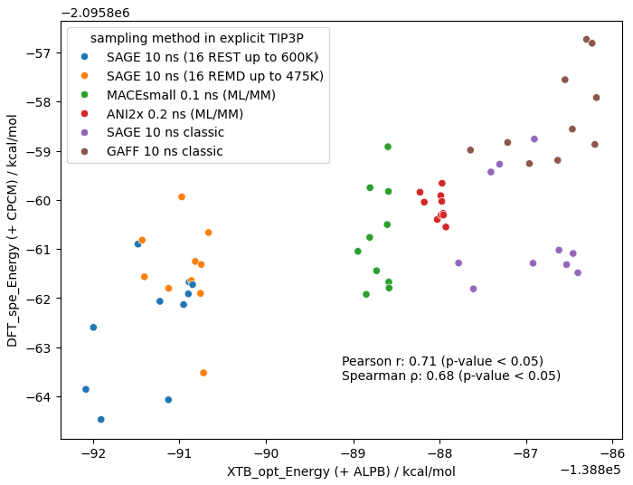

## Introduction
<p style="text-align: justify;">
In my last blog post, I tried AI co-folding model for novel chemical modalities including covalent macrocyclic molecular glue and its induced protein complexes. There were some postive feedback but no much detailed investigation was performed. As a computational chemist and growing cheminformation, I found it would be interesting to study and analyse some current AI models with physical approach and corresponding data, which could inspire some practical applications for drug discovery industry. Therefore, I decided to make some supplements in this new article that would particularly focus on two questions:

<b>1. Which are those 'good' AI models approaching physics and also with low computational cost ?</b>

<b>2. Can physics help to identify, refine or even rescure those 'imperfect' AI models ?</b>
</p>

## Key Conclusions at the Beginning
<p style="text-align: justify;">
A. Some latest machine learning force fields (MMFFs) based on atomic neural network potentials (NNPs) reach quantum mechanics (QM) accurary for organic small molecules. They could be used as DFT surragate for energy calculation quickly, despite their speed for simulation still quite inferior to those traditional force fields with classic parameters. Moreover, the fundamental architecture of NNPs may restrict their usage in coupled with enhanced sampling techniques such as Hamiltonian replica exchange MD or metadynamics.
</p>
<p style="text-align: justify;">
B. Traditional statistical mechanics could deal with most challenging chemical systems, but there are some tricky cases (e.g., atropisomerism) which require extra cautions. If such scenario was generated by AI in a wrong way, it would be even harder for physical modelling to rescure and refine.
</p>
<p style="text-align: justify;">
C. There are some mature machine learning models for predicting atomic properties in cheminformatics, which have shown subconscious benefits for computational chemistry. For example, the NAGL charge model could accelerate simulation workflow efficiently and make previously impossible parameterisation to be feasible.
</p>
<p style="text-align: justify;">
D. The AI co-folding model is able to provide structual hypothesis in a quick way (if data and training cost is ignored), while more expensive physical approaches are better for evaluation to identify and reduce false postives.
</p>

## Ligand Conformational Analysis in Solution
<p style="text-align: justify;">
For organic small molecule drugs, solution-state conformations play important roles on both receptor binding events and DMPK properties. Computational and medicinal chemists often apply strategies of conformation control to restrain or even lock bioactive state in solution for reducing entropic pentalty and enhancing binding affinity on certain target. For modalities beyond the rule of five (bRo5), their folding conformations (or so-called 'Chameleonicity') are also crucial for desired permabilities and solubilities. Following my previous article, the macrocyclic MG Elironrasib (<b>Figure 1</b>) was studied for its solution-state conformational analysis. Herein, the performance of several force fields including few popular atomic NNPs was tested by both their simulation speed for sampling and their energy accuaracy relative to QM/DFT standard reference.
</p>

 

<b>Figure 1</b>. The 2D structure of Elironrasib and its bioactive conformation as the 3D precursor minimised from covalent ternary complex crystallography (PDB: 9BFX).

### Choice of Sampling Approach
<p style="text-align: justify;">
In molecular modelling, both Monte Carlo (MC) and Molecular Dynamics (MD) argorithms are commonly used for simulation. During my PhD couple of years ago, <i>MacroModel</i> was always my first choice to sample small-molecule conformational minima used for NMR structure elucidation. The software is based on Metropolis MC and was developed by Still group, acquired by Schrodinger later. Together with encrypted OPLSx force field originally from Jorgensen group, this method is very powerful to search multiple low-energy conformers in solution. Similarly for protein modelling, there are softwares like <i>Rosetta</i> which I have used a lot since academia. However, pure MC algorithm is suitable for the NVT ensemble system with limited degrees of freedom (e.g., bond torsions) considering the ease of convergence (usually applied on solute with implicit solvation model) and I have gradually realised the importance of explicit waters for CADD research during these years in industry. Therefore, molecular dynamics with explicit solvation are preferentially chosen for conformational sampling in this study (<b>Figure 2</b>).
</p>


<b>Figure 2</b>. The mixture system for Elironrasib sovlated in water (TIP3P models) under cubic periodic boundary condition (PBC).

<p style="text-align: justify;">
There are several softwares and methods that might be suitable for such computational modelling task. With the open-source spirit and also for this personal blog, I determinied to use <i>gromacs, openmm, openff, xtb, orca, pytorch</i> and other non-commerical modules (at least free for personal use) which I have the most experience so far.
</p>

<u><i>Here are 4 common force fields used in this test:</i></u>

1. **General AMBER Force Field (GAFF)** - A conventional small-molecule force field compatible with the well-known AMBER family (used in my PhD paper)
2. **SAGE (OpenFF-2.2.1)** - The latest generation of small-molecule force field released by *Open Force Field Initiative* (I think their benchmark report to outperform GAFF)
3. **ANI2x** - The pioneer atomic neural network potential (NNP) in ANI family developed by Roitberg group, supporting most uncharged organic elements
4. **MACE** - A series of new NNPs developed after ANI (herein the distilled small model was used for simulation due to efficiency)

<p style="text-align: justify;">
The biggest chanllenge in molecular dynamics is ergodicity under Newton's law and Langevin equation. To prevent trapping in local minima and enhance sampling, I added the algorithm of replica exchange (REMD) over 300 K as well as solute tempering (REST) technique by modifying Hamiltonians. However, this trick can only be applied on classic force fields with explicit terms of bonding and non-bonding parameters. In NNPs, the forward calculation of energy and gradient force is labile based on the feature of atomic positions processed by neural network blackbox (<b>Text 3</b>), just like <i>ETKDG</i> conformer generation biased with matrix of 'distance constraints' from crystallography. Hence there is no analytic function within them for us to modulate easily in theory. The high temperature may also raise the risk of thermal instability for the system under NNPs because most of their training data are QM/DFT geometries minimised with electronic and zero-point energies in vaccum.
</p>

```python
class HybridNNP(torch.nn.Module):
    def __init__(self, atomic_numbers, ml_atoms):
        super().__init__()
        self.indices = torch.tensor(ml_atoms, dtype=torch.long, device=device)
        self.atomic_numbers = torch.tensor(atomic_numbers, device=device).unsqueeze(0)
        self.model = ANI2x(periodic_table_index=True)
        self.model.to(self.atomic_numbers.device)
    def forward(self, positions):
        positions = positions.to(self.atomic_numbers.device)
        positions = positions[self.indices]
        positions = positions.unsqueeze(0).float() * 10 # nm -> Å
        result = self.model((self.atomic_numbers, positions))
        energy = result.energies[0] * 2625.5 # Hartree -> kJ/mol
        return energy
```
**Text 3.** The block of Pytorch code for the forward calculation of atomic NNPs with ANI2x (This is a common example used in torchANI, ASE, openmm-ml and other python tools). 

<p style="text-align: justify;">
Since I did not compile the <i>gromacs</i> with <i>plumed</i> (a plugin for advanced MD) in my PC with 16 cores plus NVIDIA RTX5070 GPU, the REST simulation and metadynamics mentioned later was performed with <i>OpenMM</i> and corresponding extention tools. Honestly, there was no much difference in terms of simulation speed between two open platforms (though a bit slower than Desmond, a commerical software developed from D. E. Shaw and optimised by Schrodinger for industry) and we have modules like <i>parmed</i> and <i>OpenFF</i> interchange to convert among different formats of topology.
</p>

<p style="text-align: justify;"> 
Nevertheless, one challenge is to integrate explicit water model (i.e., TIP3P herein) with organic solute under NNPs. Traditionally, solvation modelling could be accurately processed by QM/MM approach with electronic embedding on the boundary (as emphasised by Adrian Mulholland during my PhD in Bristol). Considering the speed of computation and the charateristic of NNPs, ML/MM with mechanical embedding is an alternative approach for this study (thanks to the tutorial from <i>OpenMM</i> workshops). For building ML/MM system, most classical parameters on the solute must be removed (<b>Text 4</b>) and replaced by atomic NNPs (<b>Text 3</b>).
</p>

```python
def removeBonds(system, atoms, removeInSet=True, removeConstraints=True):

    atomSet = set(atoms)
    import xml.etree.ElementTree as ET
    xml = mm.XmlSerializer.serialize(system)
    root = ET.fromstring(xml)

    def shouldRemove(termAtoms):
        return all(a in atomSet for a in termAtoms) == removeInSet

    for bonds in root.findall("./Forces/Force/Bonds"):
        for bond in bonds.findall("Bond"):
            bondAtoms = [int(bond.attrib[p]) for p in ("p1", "p2")]
            if shouldRemove(bondAtoms):
                bonds.remove(bond)
    for angles in root.findall("./Forces/Force/Angles"):
        for angle in angles.findall("Angle"):
            angleAtoms = [int(angle.attrib[p]) for p in ("p1", "p2", "p3")]
            if shouldRemove(angleAtoms):
                angles.remove(angle)
    for torsions in root.findall("./Forces/Force/Torsions"):
        for torsion in torsions.findall("Torsion"):
            torsionAtoms = [int(torsion.attrib[p]) for p in ("p1", "p2", "p3", "p4")]
            if shouldRemove(torsionAtoms):
                torsions.remove(torsion)

    if removeConstraints:
        for constraints in root.findall("./Constraints"):
            for constraint in constraints.findall("Constraint"):
                constraintAtoms = [int(constraint.attrib[p]) for p in ("p1", "p2")]
                if shouldRemove(constraintAtoms):
                    constraints.remove(constraint)

    return mm.XmlSerializer.deserialize(ET.tostring(root, encoding="unicode"))


def removeMMInteraction(system, ml_atoms):
    newSystem = removeBonds(system, ml_atoms)
    for force in newSystem.getForces():
        if isinstance(force, mm.NonbondedForce):
            for i in range(len(ml_atoms)):
                for j in range(i):
                    force.addException(ml_atoms[i], ml_atoms[j], 0, 1, 0, True)
        elif isinstance(force, mm.CustomNonbondedForce):
            existing = set(tuple(force.getExclusionParticles(i)) for i in range(force.getNumExclusions()))
            for i in range(len(ml_atoms)):
                a1 = ml_atoms[i]
                for j in range(i):
                    a2 = ml_atoms[j]
                    if (a1, a2) not in existing and (a2, a1) not in existing:
                        force.addExclusion(a1, a2, True)
    return newSystem
```
**Text 4.** The functions to remove classical force field parameters on ligand in <i>OpenMM</i> system for solution-state ML/MM simulation.

After many trials in parameterisation and testing, I managed to get the performance of diverse simulations on Elironrasib as summarised below:

| Methods | Ensembles | Timescale | Stepsize | Constraints | Enhancement | Platform | Speed |
| :---: | :---: | :---:| :---: | :---: | :---: | :---: | :---: |
| GAFF | NPT 300 K | 10 ns | 2.0 fs/step | H-bond | None | OpenMM | 465 ns/day |
| SAGE | NPT 300 K | 10 ns | 2.0 fs/step | H-bond | None | OpenMM | 460 ns/day |
| ANI2x | NPT 300 K | 200 ps | 0.5 fs/step | None | None | OpenMM | 1.3 ns/day |
| MACE_small | NPT 300 K | 100 ps | 0.5 fs/step | None | None | OpenMM | 0.72 ns/day |
| SAGE (REMD) | NPT with 16 replica 300-475 K | 10 ns | 2.0 fs/step | H-bond | 10000 MC exchange attempts | GROMACS | 35 ns/day/rep |
| SAGE (REST) | NPT with 16 replica 300-600 K | 10 ns | 2.0 fs/step | H-bond | 10000 MC exchange attempts | OpenMM | 21 ns/day/rep |

**Table 5.** All simulation approaches used for conformational sampling of Elironrasib in explicit waters.  

<p style="text-align: justify;"> 
According to the performance (<b>Table 5</b>), It is obvious that the simulation speed with two NNPs is <b>much slower</b> than the other two classical force fields, while the latter methods spent more time on the initial parameterisation (i.e., compute BCC atomic charges with semi-empirical AM1 protocol) regarding Elironrasib has more than 150 atoms. Given the timescale especially for NNPs, these modelling were supposed to sample still limited geometries distinct from the initial structure (i.e., the bioactive state, <b>Figure 1</b>). Neverthless, there are 2 core questions in my mind:
</p>

**Which of those simulations sample the most of low-energy conformers efficiently?**

**Any significant conformational change from the bioactive state during landscape exploration?**

### Evaluation with Quantum Mechanics

<p style="text-align: justify;"> 
For answering the first question, it is necessary to run QM-level energy minimisations as the higher standard to estimate these simulation qualities (<b>Workflow</b>). To ensure the accuracy of sampling geometries, up to 1000 snapshots were extracted from each simulation, of which each Elironrasib solute was optimised with semi-empirical XTB under implicit ALPB model. I believe such accuracy is sufficient before further single-point energy (SPE) calculation at DFT level (plus PCM model if necessary) based on my experience in QM calculations: <b>Geometry is less sensitive to basis set than energy, and even just semi-empirical method is often enough for the optimisation task.</b>
</p>


**Workflow.** The workflow for searching low-energy conformations of Elironrasib (p.s. plot style generated by Gemini).

<p style="text-align: justify;"> 
Although the initial guess and iterations of self-consistent field (SCF) calculation in XTB is much faster than in DFT, I still need to set the convergence criteria as crude as possible in order to finish thousands of ensemble optimisations in days on my PC. By testing on the example of bioactive conformation for Elironrasib (<b>Figure 6</b>), I think the error by such quick minimisation is acceptable and it is reasonable to sacrefice accuracy for efficiency when necessary (p.s. one of the most important lessons I have learnt in industry)
</p>


| XTB opt. convergence criteria | aligned best rms Å |	relative XTB opt. energy (+ ALPB) kcal/mol | relative DFT SPE by looseSCF (+ CPCM) kcal/mol | relative DFT SPE by NormSCF (+ CPCM) kcal/mol |
| :---: | :---: | :---:| :---: | :---: |
| extreme | 0.000 | 0.000 | 0.087 | 0.000 |
| vtight | 0.042 | 0.003 | 0.124 | 0.038 |
| tight	| 0.791	| 0.471 | 1.647 | 1.561 |
| normal | 0.777 | 0.872 | 1.350 | 1.261 |
| lax | 1.077 | 2.039 | 2.123 | 2.036 |
| loose	| 1.230	| 2.673 | 1.818 | 1.734 |
| sloppy | 1.235 | 2.748 | 1.960 | 1.876 |
| *crude*	| *1.264* | *3.471* | *2.321* | *2.238* |
| ff_original | 1.310 | 35.625 | 20.528 | 20.456 |

**Figure 6.** The XTB geometry optimisations and DFT single point energy calculations on Elironrasib bioactive state extracted and minimied (MMFF) from protein co-crystallography (PDB: 9BFX). A sufficent accuracy was afforded by the quickest *crude* minimisation and *loose* SCF calculation. 

For DFT SPE calculation on conformers, my favorate method is *wB97X(D3bj)/def2-TZVP* which is a range-separated hybrid functional with dispersion correction under triple-zeta basis set. I remember this method was recommanded by Grimme group to calculate the mid-size system (> 100 atoms) including signifcant non-covalent interactions (p.s. one of the weakness for B3LYP). Although no diffusion function (time-consuming) was added in the basis set, such method used to reproduce NMR data accurately for my PROTACs folding in solutions (one of my PhD projects almost 5 years ago). I am also glad to see similar DFT methods were later used by MACE and Meta FAIR Chemistry teams to generate various <i>OMol</i> database for training their NNPs. Due to limited computational resource, the SCF convergence criteria in *orca* was set to loose (i.e., $\mathbf{1.0 \times 10^{-5}}$ a.u. change in energy and also rms if optimiser such as DIIS added) for getting each Elironrasib conformer's SPE quickly (around 20-30 mins in my PC). Although this might be a really low standard for *Gaussian* which set over $\mathbf{1.0 \times 10^{-7}}$ a.u., such loose criteria is same as the default quick setting in *Jaguar* and it approach closely to the normal mode ($\mathbf{1.0 \times 10^{-6}}$ a.u.) by *orca* run in this study (**Figure 6**).

### Efficiency on Elironrasib Conformational Sampling and Energy Estimation

<p style="text-align: justify;">
According to the ECDF plot (<b>Figure 7</b>), most low-energy conformers of Elironrasib are sampled from the classical mechanics with enhanced simulation technique. The SAGE force field powered by replica exchange and solute tempering are able to produce most stable geometries which can be recognised by XTB minimisations with implicit ALPB solvation.
</p>


**Figure 7**. The empirical cumulative distribution of conformational energies (XTB optimised) from each samplling method. 

<p style="text-align: justify;">
For feasible DFT SPE calculations, 10 lowest energy XTB optimised conformers were extracted from each simulation approach and estimated by <i>wB97X(D3bj)/def2-TZVP</i>. There is clear correlation between the SOTA semi-empirical XTB and QM energies under implicit solvation model (<b>Figure 8</b>). Most low-energy conformers ranked by DFT are still sampled from the REST with classical SAGE force field.
</p>



**Figure 8**. The correlation between XTB optimised energies and DFT SPE with *wB97X(D3bj)/def2-TZVP*.

<p style="text-align: justify;">
Based on these XTB optimised geometries, then I evaluated their energies given by 4 larger NNP models (MACE and UMA) respectively trained from OMol dataset released in recent years. Because most models have not supported any solvent correction yet, I have to exclude the CPCM component in my DFT for an reasonable comparsion. To my surprise, these NNPs reach to the DFT accuracy incrediably (<b>Figure 9</b>), especially for UMA/OMol25 models, and their SPE task finish just in seconds. Now I believe what annuouced by Meta FAIR Chemistry team: <b>MLFFs could be a real DFT surrogate for computational chemistry.</b> Meanwhile, I am looking forward to the development of AI models that accelerate continuum solvation calculations based on surface cavity and electrostatics (such as PCM or COSMO).
</p> 


**Figure 9**. Benchmark some latest NNPs with DFT-calculated energies on Elironrasib conformers from MD sampling and XTB optimisations. 

### Hydrophobic Collapse and Atropisomerism for Elironrasib

<p style="text-align: justify;">
Double check with RMSD and Radius of Gyration (Rg) plots in REST simulation (<b>Figure 10a</b>), more compact geometries on Elironrasib energy landscape were explored from the initial bioactive state (<b>magenta stick A</b>) through the addition of MC exchange argorithm among MD replicas. The linker branch (covalent alkyne warhead for KRAS G12C) could fold back and collapse with the macrocyclic core during enhanced sampling, which is also shown in the global minimum of conformational ensembles estimated by QM (<b>grey stick, Figure 10b</b>). Apart from that change, the flip of morpholine ring was also observed from equatorial state (3.9 Å) to axial state (3.0 Å) as indicated by the shift of distance between aniline/tertiary-nitrogen and substitued beta-carbon atoms.
</p>


**Figure 10**. The hydrophic collpase of Elironrasib conformations was observed from REST simulation (e.g., states B and D), which was also identified in the lowest energy conformer from QM calculations (grey) and corresponding geometric cluster (hierarchical rmsd cutoff = 1.5 Å). This folding state in water is very different (aligned rmsd > 3.5 Å) from the bioactive one as required to form ternary complex (state A, magenta). 

<p style="text-align: justify;">
Nonetheless, the conformational exchange was never observed on another bi-aryl torsion in simulation (remember this motif was wrongly predicted by the co-folding model according to my last article). Given the bulkness of two aromatic rings, it is suspicious that Elironrasib has Atropisomersim within it (<b>Figure 11</b>). Hence I run ligand REST simulation again based on 'the other atropisomer' initially generated by Boltz-2 from the last blog, neither did the exchange happen... This was finally confirmed by reading the paper published from Revolution: <b>Elironrasib is a specific atropisomer.</b> 


**Figure 11**. The distribution of constrained dihedral angle from two REST simulations respectively on Elironrasib (left) and the other atropiosmer generated from co-folding model (right).

<p style="text-align: justify;">
In classic MD, thermodynamics at 300K usually allow system to overcome most kinetic barriers within <em>15 kJ/mol</em>, which could be boosted up to <em>15 kcal/mol</em> by enhanced techniques such as REST with care. For example, we might occasionally observe <i>cis</i> isomerisation from <i>trans</i>-amide if the harmonic parameter of torisonal potential is not overfitted in the force field. However, the atropisomerism usually has the energy barrier over <em>25 kcal/mol</em> (as elucidated by NMR experiment or QM scan) and we chemists often identify atropisomers as different compounds given their extremely slow conversion rates under Eyring equation. There are few KRAS switch-II inhibitors in clinic are atropisomers and they have the half-life over dosens of years as far as I know... Anyway this part of study has provided me with an important insight: <b>There are some fundamental mistakes from the current AI which can be hardly rescued by physics. For adanvced development, models must have a deeper, more human-level understanding of chemistry and physics.</b>
</p>

## Highly Flexible Elironrasib Ligand bound with CYPA

### The Indication from Unbiased MD Analysis

<p style="text-align: justify;">
Given diverse conformations of Elironrasib freely in solution, its CYPA-bound state became the next focus in this study. Accoring to my last blog, Boltz-2 could generate a variaty of co-folding models in the CYPA binary complex. Even though most stereochemistry and all atropisomerism are not correct, the diffusion result proposed an hypothesis that KRAS binding motif and G12C warhead branch are flexibile when exposed to the solvent around CYPA, just like hetero-bifunctional PROTAC degraders. I promised to validate it with physics in my last blog.  
</p>

<p style="text-align: justify;">
Starting from the ternary complex structure (PDB: 9BFX), the KRAS G12C and corresponding covalency was removed in order to simulate CYPA binary complex in solution. For comprehensive sampling, I replicated the system with 20 copies starting from different velocities (10 replica run with <i>gromacs</i> while others using <i>OpenMM</i>). Both trajactorys' rmsd and principal component analysis (PCA) indicated no single state was converged and populated significantly (<b>Figure 12</b>). Each 10 ns pathway seems to visit a unique conformational space and they were clustered into 3 major ensembles: <b>The Elironrasib linker warhead hang around in the absense of KRAS G12C.</b> Noteworthy, the exchange of atropisomer was neither observed on Elironrasib when embraced with CYPA. 


**Figure 12**. The distribution of Elironrasib rmsd to the initial bioactive state and normalised PCA density under CYPA alignment. Diverse ligand conformations were observed from unbiased MD simulations overall (10 *gromacs* plus 10 *OpenMM* replica of 10 ns relaxation starting from crystallography PDB:9BFX without KRAS G12C). The free energy landscape derived from Boltzmann inversion suggested universal stabilities among 3 major conformational ensembles.     

### Further Confirmation through Binding Pose Metadynamics (BPMD)