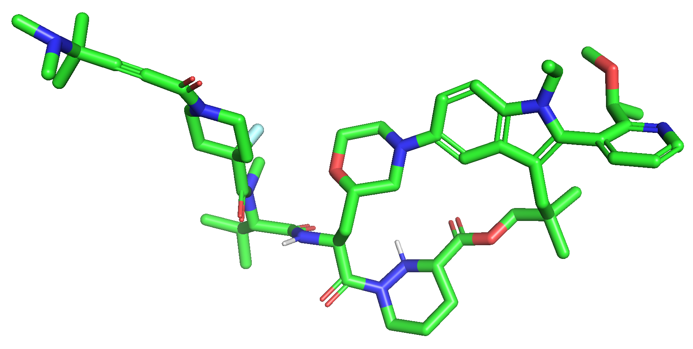
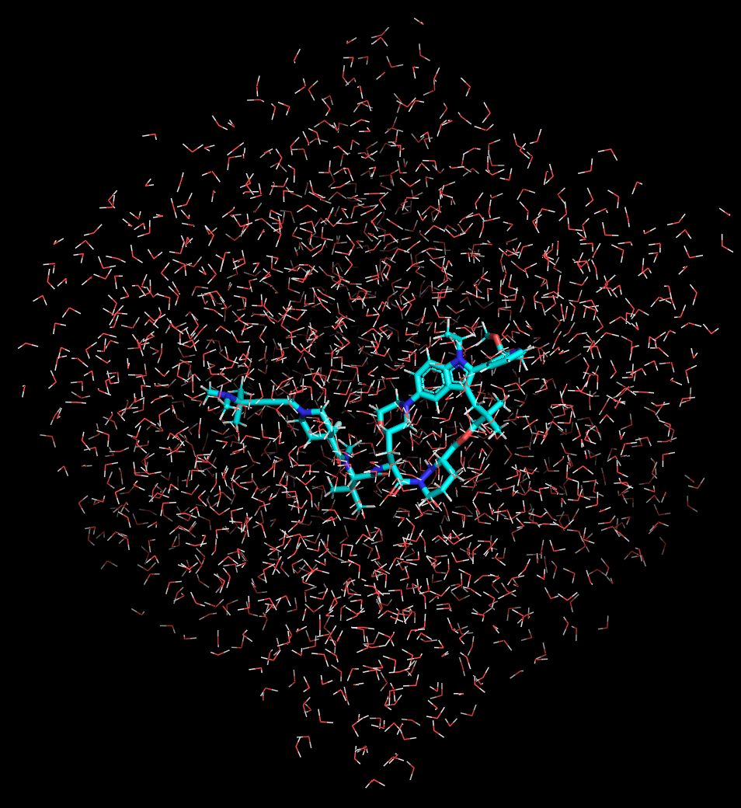
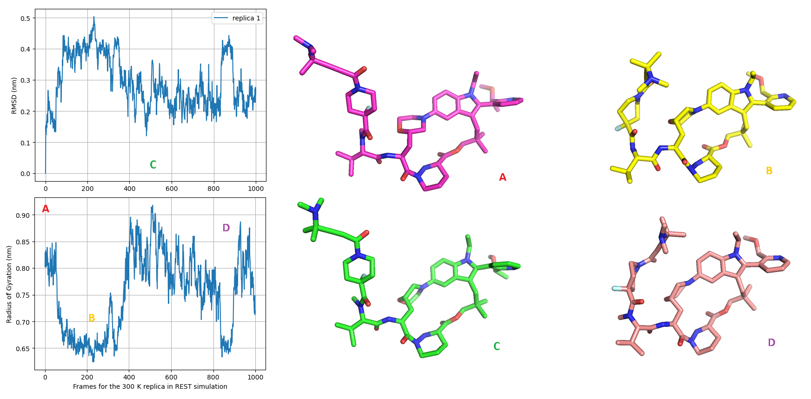
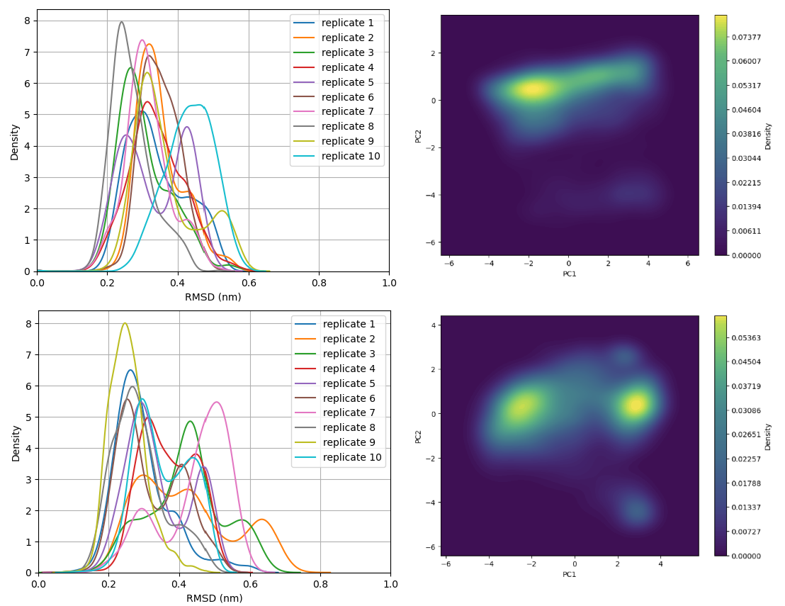
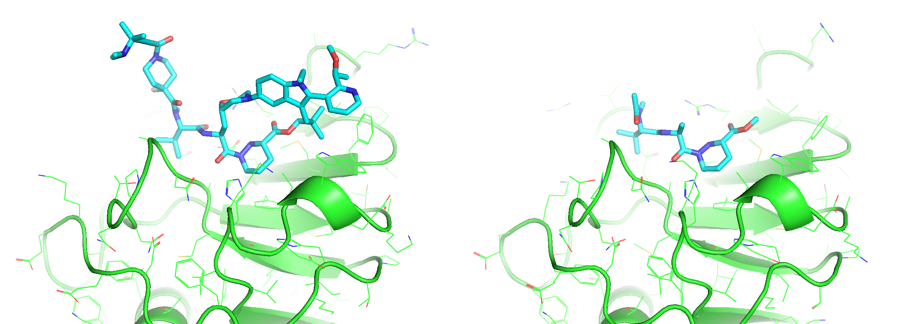
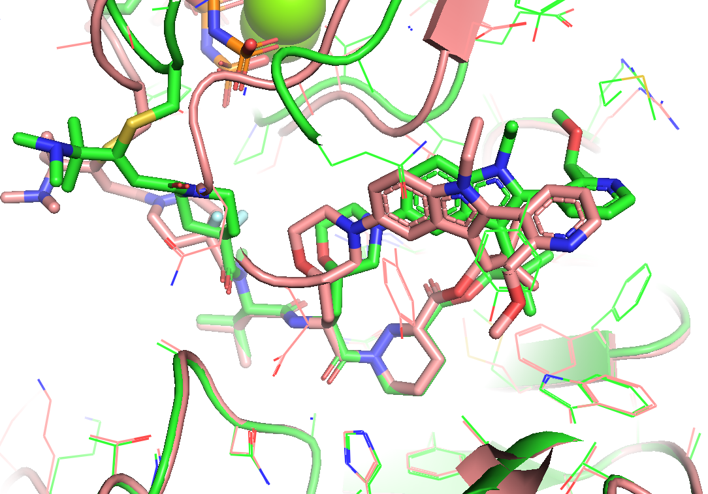
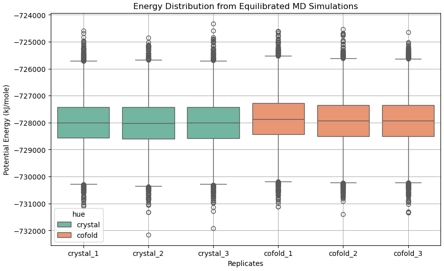

## Introduction

<p style="text-align: justify;">
In my last blog post, I explored Boltz-2 co-folding model applied to novel chemical modalities, including covalent macrocyclic molecular glue (MG) Elironrasib and its induced protein complexes. While the post received positive feedback, a detailed investigation was not performed. As both a computational chemist and a growing expert in cheminformatics, I believe it is crucial to analyse current AI models through a physics-based lens, leveraging corresponding data to inspire practical applications within the drug discovery industry. Therefore, this new article will serve as a supplement, specifically designed to address two key questions:

<b>1. Which are those 'good' AI models that most closely approach physics as the ground truth, while also maintaining low computational cost?</b>

<b>2. Can physics effectively guide the identification, refinement, or even rescue of 'imperfect' AI models so far for molecular modelling?</b>
</p>

## Key Conclusions at the Beginning

<b>A. Machine Learning Force Fields vs. Traditional Methods</b>
<p style="text-align: justify;">
The latest <b>Machine Learning Force Fields (MLFFs)</b>, often based on <b>Atomic Neural Network Potentials (NNPs)</b>, have achieved <b>Quantum Mechanics (QM)</b> level accuracy for small organic molecules. These models can serve as <b>Density Functional Theory (DFT) surrogates</b> effectively for rapid energy calculations. However, the speed of NNPs for molecular simulation remains significantly inferior to traditional force fields utilising classic parameters. Furthermore, the inherent architecture of NNPs may pose restrictions on their integration with advanced techniques for enhanced sampling, such as Hamiltonian replica exchange Molecular Dynamics (MD) or Metadynamics depending on the collective variable (CV) in physical quantity.
</p>

<b>B. The Challenges of Post-processing AI Prediction with Statistical Mechanics</b> 
<p style="text-align: justify;">
While traditional <b>Statistical Mechanics</b> methods are robust approximations of QM macroscopically and are capable of handling most challenging chemical systems, certain tricky cases (e.g., <b>atropisomerism</b>) need extreme caution. If an incorrect stereochemical scenario is generated by an AI model, the subsequent physical modeling and refinement process can become substantially more difficult to rectify.
</p>

<b>C. Practical Impact of Machine Learning Models from Cheminformatics to Molecular Modelling</b>
<p style="text-align: justify;">
We observe mature machine learning models within cheminformatics dedicated to predicting atomic properties, offering significant, though often understated, benefits to computational chemistry workflows. There are some notable examples including <b>graph-based pKa and charge models</b>, which facilitate force-field parameterisation tasks and accelerate simulation pipelines efficiently.
</p>

<b>D. The Role of Co-Folding and Physical Evaluation</b>
<p style="text-align: justify;">
While co-folding models can generate structural hypothesis rapidly (provided that the associated data and training overhead are disregarded), more resource-intensive physical approaches are optimally suited for subsequent evaluation and identification of false positives, providing necessary check, refinement and understand that serve <b>Structure-Based Drug Design (SBDD)</b> more closely.
</p>

## Ligand Conformational Analysis in Solution
<p style="text-align: justify;">
For small organic molecule drugs, <b>solution-state conformations</b> are critical, influencing both receptor binding events and DMPK (Drug Metabolism, Pharmacokinetics) properties. Computational and medicinal chemists frequently employ conformational control strategies to restrict or "lock" the bioactive state in solution. This approach is essential for reducing the entropic penalty and enhancing binding affinity for a specific target. For modalities that extend <b>beyond the Rule of Five (bRo5)</b>, their folding behavior (often termed <b>'Chameleonicity'</b>) is equally crucial for achieving desired permeability and solubility.
</p>
<p style="text-align: justify;">
Following the work introduced in my previous article, I selected the macrocyclic MG Elironrasib (<b>Figure 1</b>) again for a detailed solution-state conformational analysis. Herein, we assess the performance of several force fields, including popular Atomic NNPs. The evaluation focuses on two key metrics: their <b>simulation speed</b> for conformational sampling and their <b>energy accuracy</b> relative to the established QM/DFT standard reference.
</p>

 

<b>Figure 1</b>. The 2D structure of Elironrasib and its bioactive conformation as the precursor minimised from covalent ternary complex crystallography (PDB: 9BFX).

### Choice of Sampling Approach
<p style="text-align: justify;">
In molecular modelling, both the <b>Monte Carlo (MC)</b> and <b>Molecular Dynamics (MD)</b> algorithms are routinely employed for simulation studies. During my PhD, I frequently relied on <i>MacroModel</i>, a software based on the Metropolis MC algorithm (originally developed by the Still group and later acquired by Schrödinger), for sampling small-molecule conformational minima used in NMR structure elucidation. Coupled with the proprietary <b>OPLSx force-field</b> (originally from the Jorgensen group), this method is highly effective for searching multiple low-energy conformers in an implicit solution environment. Similarly for the protein modelling, there are MC-based softwares such as <i>Rosetta</i> which I often use to handle receptor structures when needed.
</p>
<p style="text-align: justify;">
However, pure MC algorithms are primarily suitable for equilibrating systems with limited degrees of freedom (e.g., rotamers) within the <b>NVT ensemble</b> due to ease of convergence, and they inherently struggle to reveal detailed <b>kinetic information</b>. Consequently, MC is typically applied to predict only the <b>thermodynamic properties</b> of the solute with an implicit solvation model. Over the years in industry, I have come to appreciate the critical importance of <b>explicit water</b> models for accurate Computer-Aided Drug Design (CADD) research. Therefore, the MD integrated with explicit solvation is preferentially chosen for conformational sampling in this study (<b>Figure 2</b>).
</p>


<b>Figure 2</b>. The mixture system for Elironrasib sovlated in water (TIP3P models) under cubic periodic boundary condition (PBC).

<p style="text-align: justify;">
For this computational modeling task, I have committed to using open-source tools and modules (or those free for personal use), aligning with the spirit of this personal blog and my current expertise. The primary software platforms employed include <i>GROMACS</i>, <i>OpenMM</i>, <i>OpenFF</i>, <i>XTB</i>, <i>ORCA</i>, and <i>PyTorch</i>.
</p>

<u><i>The comparison will focus on four representative force fields, encompassing both conventional and advanced ML approaches:</i></u>

1. **General AMBER Force Field (GAFF)** - A conventional, parameterised small-molecule force field, highly compatible with the widely used AMBER family of biopolymer force fields. This represents a traditional, established methodology and was used in my PhD work.
2. **SAGE (OpenFF-2.2.1)** - The latest generation small-molecule force field released by the <i>Open Force Field Initiative</i>. SAGE employs the innovative <i>SMIRNOFF</i> framework for transferable parameterisation and is often benchmarked as outperforming <i>GAFF</i>.
3. **ANI2x** - The pioneer Atomic Neural Network Potential (NNP) from the ANI family, developed by the Roitberg group. It supports the most common elements found in uncharged organic molecules.
4. **MACE** - A modern class of NNPs that utilise advanced graph architecture to enhance both accuracy and computational efficiency. Its distilled small model has been selected for my simulation to maximise performance.

<p style="text-align: justify;">
The greatest challenge in MD simulations is achieving ergodicity under the constraints of Newton's laws and the Langevin equation. To prevent the system from becoming trapped in local minima and to significantly enhance conformational sampling, I incorporated the Replica Exchange (REMD) algorithm, operating across temperatures exceeding 300 K, as well as the Solute Tempering (REST) technique through Hamiltonian modification. 
</p>

<p style="text-align: justify;">
However, these established enhanced sampling methods can only be applied to classic force fields that possess explicit, analytically defined terms for bonding and non-bonding interactions. In NNPs, the energy and gradient forces are calculated through a complex forward pass of the atomic position features within the neural network's "black box" (<b>Text 3</b>). This process, analogous to methods like <i>ETKDG</i> conformer generation that is biased by 'distance constraints' matrices derived from crystallography, lacks an easily modulated analytic Hamiltonian function. Consequently, it is theoretically difficult to modify the system Hamiltonian directly as required in REST technique. Furthermore, subjecting the system to high temperatures poses a significant risk of thermal instability under NNPs, as the majority of their training data consists of QM/DFT geometries minimised typically at 0 K and/or in vacuum for the zero-point energy, lacking explicit thermal and/or environmental correction.
</p>

```python
class HybridNNP(torch.nn.Module):
    def __init__(self, atomic_numbers, ml_atoms):
        super().__init__()
        self.indices = torch.tensor(ml_atoms, dtype=torch.long, device=device)
        self.atomic_numbers = torch.tensor(atomic_numbers, device=device).unsqueeze(0)
        self.model = ANI2x(periodic_table_index=True)
        self.model.to(self.atomic_numbers.device)
    def forward(self, positions):
        positions = positions.to(self.atomic_numbers.device)
        positions = positions[self.indices]
        positions = positions.unsqueeze(0).float() * 10 # nm -> Å
        result = self.model((self.atomic_numbers, positions))
        energy = result.energies[0] * 2625.5 # Hartree -> kJ/mol
        return energy
```
<b>Text 3.</b> The block of Pytorch code for the forward calculation of atomic NNPs with ANI2x (This is a common example used in torchANI, ASE, openmm-ml and other python tools).

<p style="text-align: justify;">
A further significant challenge arises from the charged state of organic small molecules in solution. Elironrasib contains a tertiary amine located near its covalent warhead. Based on the pKa prediction from <i>pkasolver</i> (<b>Figure 4</b>), this nitrogen atom should be preferentially protonated in water at physiological pH (i.e., > 7.4). However, most current atomic NNPs, including the ANI2x and MACE models tested in this study, are restricted to calculations involving only the neutral state. To maintain a feasible and direct comparison across all methods, I had to exclude such more biologically relevant protonation/charge from the simulation. Although this might introduce certain limitation to the accuracy, corresponding paramterisation become easier for classical force fields (i.e., GAFF and SAGE) in this case. 
</p>


<b>Figure 4.</b> The pka model <i>pkasolver</i> suggests the value of corresponding matched-pair around <b>7.6</b>, indicating the protonation state is prefered in water.

<p style="text-align: justify;">
Due to the lack of <i>PLUMED</i> compilation (essential plugin for advanced MD) with <i>GROMACS</i> installed in my local machine (p.s., a PC with 16 CPU cores, 16 GB RAM, and an RTX5070 GPU), the REST simulation and metadynamics mentioned later were performed using <i>OpenMM</i> and its corresponding extension tools. In practice, there was no significant difference in simulation speed between these two open platforms (<i>GROMACS</i> and <i>OpenMM</i>), though I noted they feel slightly slower than commercial software like <i>Desmond</i> which is developed by <i>D. E. Shaw</i> and optimised by <i>Schrödinger</i> for industrial use. Anyway we have modules like <i>ParmEd</i> and <i>OpenFF</i> interchange to convert topology in different formats. 
</p>

<p style="text-align: justify;">
A critical challenge, however, lies in integrating explicit water models (TIP3P in this study) with the organic solute when using NNPs. Traditionally, accurate solvation modeling is achieved via the QM/MM approach with electronic embedding at the boundary (a principle emphasised by Adrian during my PhD in Bristol). Considering both the necessary computational speed and the NNPs characteristics, ML/MM with mechanical embedding was chosen as the alternative approach for this study (guided by a tutorial from <i>OpenMM</i> workshops). To construct this ML/MM system, most of the classical parameters governing the solute (bonds, angles, torsions, non-bonded terms) must be removed (<b>Text 5</b>) and entirely replaced by the atomic NNPs (<b>Text 3</b>).
</p>

<div style="max-height: 300px; overflow-y: auto;">

```python
def removeBonds(system, atoms, removeInSet=True, removeConstraints=True):

    atomSet = set(atoms)
    import xml.etree.ElementTree as ET
    xml = mm.XmlSerializer.serialize(system)
    root = ET.fromstring(xml)

    def shouldRemove(termAtoms):
        return all(a in atomSet for a in termAtoms) == removeInSet

    for bonds in root.findall("./Forces/Force/Bonds"):
        for bond in bonds.findall("Bond"):
            bondAtoms = [int(bond.attrib[p]) for p in ("p1", "p2")]
            if shouldRemove(bondAtoms):
                bonds.remove(bond)
    for angles in root.findall("./Forces/Force/Angles"):
        for angle in angles.findall("Angle"):
            angleAtoms = [int(angle.attrib[p]) for p in ("p1", "p2", "p3")]
            if shouldRemove(angleAtoms):
                angles.remove(angle)
    for torsions in root.findall("./Forces/Force/Torsions"):
        for torsion in torsions.findall("Torsion"):
            torsionAtoms = [int(torsion.attrib[p]) for p in ("p1", "p2", "p3", "p4")]
            if shouldRemove(torsionAtoms):
                torsions.remove(torsion)

    if removeConstraints:
        for constraints in root.findall("./Constraints"):
            for constraint in constraints.findall("Constraint"):
                constraintAtoms = [int(constraint.attrib[p]) for p in ("p1", "p2")]
                if shouldRemove(constraintAtoms):
                    constraints.remove(constraint)

    return mm.XmlSerializer.deserialize(ET.tostring(root, encoding="unicode"))


def removeMMInteraction(system, ml_atoms):
    newSystem = removeBonds(system, ml_atoms)
    for force in newSystem.getForces():
        if isinstance(force, mm.NonbondedForce):
            for i in range(len(ml_atoms)):
                for j in range(i):
                    force.addException(ml_atoms[i], ml_atoms[j], 0, 1, 0, True)
        elif isinstance(force, mm.CustomNonbondedForce):
            existing = set(tuple(force.getExclusionParticles(i)) for i in range(force.getNumExclusions()))
            for i in range(len(ml_atoms)):
                a1 = ml_atoms[i]
                for j in range(i):
                    a2 = ml_atoms[j]
                    if (a1, a2) not in existing and (a2, a1) not in existing:
                        force.addExclusion(a1, a2, True)
    return newSystem
```
</div>

<b>Text 5.</b> The functions to remove classical force field parameters on ligand in <i>OpenMM</i> system for ML/MM simulation in solution.

Following extensive trials in parameterisation and testing, the performance of the diverse simulations conducted on <i>Elironrasib</i> is summarised below:

| Methods | Ensembles | Timescale | Stepsize | Constraints | Enhancement | Platform | Speed |
| :---: | :---: | :---:| :---: | :---: | :---: | :---: | :---: |
| GAFF | NPT 300 K | 10 ns | 2.0 fs/step | H-bond | None | OpenMM | **465 ns/day** |
| SAGE | NPT 300 K | 10 ns | 2.0 fs/step | H-bond | None | OpenMM | **460 ns/day** |
| ANI2x | NPT 300 K | 200 ps | 0.5 fs/step | None | None | OpenMM | **1.3 ns/day** |
| MACE_small | NPT 300 K | 100 ps | 0.5 fs/step | None | None | OpenMM | **0.72 ns/day** |
| SAGE (REMD) | NPT with 16 replica 300-475 K | 10 ns | 2.0 fs/step | H-bond | 10000 MC exchange attempts | GROMACS | **35 ns/day/rep** |
| SAGE (REST) | NPT with 16 replica 300-600 K | 10 ns | 2.0 fs/step | H-bond | 10000 MC exchange attempts | OpenMM | **21 ns/day/rep** |

<b>Table 6.</b> All simulation approaches and details for the conformational sampling of Elironrasib in explicit water.  

<p style="text-align: justify;"> 
The performance data in <b>Table 6</b> clearly demonstrates that the operational simulation speed of the two NNPs is <b>orders of magnitude slower</b> than that of the classical force fields. This gap is notable, even when considering that the classical methods required additional initial time for BCC atomic charge parameterisation (using the semi-empirical AM1 protocol) on Elironrasib's 150+ atoms. Given the limited timescales, particularly for the NNPs, these models are expected to sample only a narrow set of geometries distinct from the initial bioactive state (<b>Figure 1</b>). However, two core questions remain in my mind:

**Which of these simulations is most efficient at sampling low-energy conformers?**

**Was any significant conformational change observed  during the landscape exploration?**
</p>

### Evaluation with Quantum Mechanics Calculations

<p style="text-align: justify;"> 
To address the first core question - <b>the relative quality of the simulation methods</b>, it is essential to benchmark the sampled geometries against a high-level quantum mechanical standard (<b>Figure 7</b>). This required significant post-processing efforts: Up to 1000 snapshots were extracted from each simulation, and the Elironrasib solute geometry from each was minimised using the semi-empirical <i>XTB</i> method under the implicit ALPB solvation model.
</p>

<p style="text-align: justify;">
Based on my experience in QM calculations, this level of initial optimisation is sufficient before proceeding to single-point energy (SPE) calculation at the higher Density Functional Theory (DFT) level. This is because <b>geometry is generally less sensitive to basis set than energy is, and semi-empirical methods are often adequate for preliminary optimisation tasks.</b>
</p>


<b>Figure 7.</b> The workflow for searching low-energy conformations of Elironrasib.

<p style="text-align: justify;"> 
Despite <i>XTB</i> being significantly faster than full DFT for the initial guess and Self-Consistent Field (SCF) calculation iterations, completing thousands of ensemble optimisations still need setting the convergence criteria as crude as possible on my PC. As demonstrated by the test on the Elironrasib bioactive conformation (<b>Figure 8</b>), the error introduced by such quick minimisation is acceptable. This reflects a crucial lesson for me learnt in the biotech industry: <b>it is often necessary and reasonable to sacrifice a small degree of accuracy for overwhelming gains in efficiency.</b>
</p>


| XTB opt. convergence criteria | aligned best rms Å |	relative XTB opt. energy (+ ALPB) kcal/mol | relative DFT SPE by looseSCF (+ CPCM) kcal/mol | relative DFT SPE by NormSCF (+ CPCM) kcal/mol |
| :---: | :---: | :---:| :---: | :---: |
| extreme | 0.000 | 0.000 | 0.087 | 0.000 |
| vtight | 0.042 | 0.003 | 0.124 | 0.038 |
| tight	| 0.791	| 0.471 | 1.647 | 1.561 |
| normal | 0.777 | 0.872 | 1.350 | 1.261 |
| lax | 1.077 | 2.039 | 2.123 | 2.036 |
| loose	| 1.230	| 2.673 | 1.818 | 1.734 |
| sloppy | 1.235 | 2.748 | 1.960 | 1.876 |
| *crude*	| *1.264* | *3.471* | *2.321* | *2.238* |
| ff_original | 1.310 | 35.625 | 20.528 | 20.456 |

<b>Figure 8.</b> The <i>XTB</i> geometry optimisations and DFT single-point energy calculations on Elironrasib bioactive state, extracted and minimised (MMFF) from protein co-crystallography (PDB: 9BFX). A sufficent accuracy was afforded by the quickest *crude* minimisation and *loose* SCF calculation. 

For DFT SPE calculation on the minimised conformers, my preferred methodology is <b>wB97X(D3bj)/def2-TZVP</b> which is a range-separated hybrid functional with dispersion correction under a triple-zeta basis set. I remember this was recommended by the Grimme group for calculating mid-sized systems (> 100 atoms) with significant non-covalent interactions (addressing a common weakness of methods like B3LYP). Although no expensive diffusion function was added in the basis set, this method accurately reproduced solution-state NMR data for my PROTAC folding studies few years ago. Furthermore, I am encouraged to see similar DFT methods now being used by the MACE and Meta FAIR Chemistry teams to generate the OMol database for training their NNPs. Due to computational resource limitations, the SCF convergence criteria in *ORCA* were set to <b>loose</b> (i.e., $1.0 \times 10^{-5}$ a.u. change in energy, and RMS if an optimiser like DIIS is added) to quickly obtain each Elironrasib conformer’s SPE (approx. 20-30 minutes per conformer on my PC). While this is a low standard compared to <i>Gaussian</i>'s typical $1.0 \times 10^{-7}$ a.u. default, this <i>ORCA</i> 'loose' criteria is identical to the default quick setting in <i>Jaguar</i> and closely approaches the 'normal' mode ($1.0 \times 10^{-6}$ a.u.) run in this study (<b>Figure 8</b>).

### Efficiency on Elironrasib Conformational Sampling and Energy Estimation

<p style="text-align: justify;">
To address the efficiency of low-energy conformer generation, I first analysed the results using an Empirical Cumulative Distribution Function (ECDF) plot at <i>XTB</i> level (<b>Figure 9 left</b>). This plot clearly indicates that the majority of low-energy Elironrasib conformers were sampled using classical mechanics combined with enhanced simulation techniques. Specifically, the SAGE force field powered by REST proved most effective, yielding the most stable geometries identified by <i>XTB</i> minimisation with the implicit ALPB solvation model.
</p>

<p style="text-align: justify;">
To establish the QM standard feasibly, the 10 lowest energy <i>XTB</i>-optimised conformers from each simulation approach were subjected to DFT SPE calculation using the high-level <b>wB97X(D3bj)/def2-TZVP</b> method coupled with CPCM correction. A strong correlation was observed between the <i>XTB</i> semi-empirical energies and the final DFT energies under the implicit solvation model (<b>Figure 9 right</b>). Critically, the majority of the lowest energy conformers, as ranked by DFT, were still sourced from the highly efficient REST sampling utilising the classic SAGE force field.
</p>


<b>Figure 9.</b> The Empirical Cumulative Distribution of conformational energies (<i>XTB</i>-optimised) in each samplling method. For low-energy geometries accumulated from each approach, a clear correlation was observed between the semi-empirical XTB optimisations and the DFT SPE at <b>wB97X(D3bj)/def2-TZVP</b>.

### Benchmarking Larger NNP Models

<p style="text-align: justify;">
Using these <i>XTB</i>-optimized geometries and DFT SPE, I then evaluated their energies against four larger NNP models (i.e., <i>MACE</i> and <i>UMA</i> trained on the <i>OMol</i> datasets released in recent years). Because most current NNP models do not yet support explicit solvent correction terms, the CPCM component was necessarily excluded from the DFT reference calculation to ensure a valid comparison.
</p>

<p style="text-align: justify;">
The results are striking as shown in <b>Figure 10</b>: <u>These NNPs achieve incredible proximity to DFT accuracy, particularly the latest <i>UMA/OMol25</i> models, all while completing the SPE task in mere seconds.</u>
</p>

<p style="text-align: justify;">
This evidence strongly supports the announcement made by the Meta FAIR Chemistry team: <b>Machine Learning Force Fields (MLFFs) are poised to become a true DFT surrogate for computational chemistry.</b> Moving forward, I anticipate and look forward to the development of more AI models designed to accelerate continuum solvation calculations based on surface electrostatics and cavity, approximate PCM or COSMO for instance.
</p> 


<b>Figure 10.</b> Benchmark of some latest NNPs with DFT-calculated energies on Elironrasib conformers sourced from MD sampling and XTB optimisations. 

### Hydrophobic Collapse and Atropisomerism for Elironrasib

<p style="text-align: justify;">
Double-checking the simulation trajectory with RMSD (Root Mean Square Deviation) and Radius of Gyration (Rg) plots (<b>Figure 11 upper</b>), I observe that the REST enhanced sampling effectively explored <b>more compact geometries</b> of Elironrasib compared to the initial bioactive state (magenta stick A). This collapse is a result of the linker branch (containing the covalent alkyne warhead for KRASG12C) folding back and interacting with the macrocyclic core. This key folding state is also identified as the current global minimum among the conformational ensembles estimated by DFT (grey stick, <b>Figure 11 lower</b>).
</p>

<p style="text-align: justify;">
In addition to this collapse, a <b>morpholine ring flip</b> was also observed, shifting from an equatorial state (with a distance of 3.9 Å) to an axial state (with a distance of 3.0 Å), as indicated by the change in distance between the aniline tertiary-nitrogen and the substituted beta-carbon atoms. Nevertheless, the intramolecular hydrogen bond (IMHB) between the morpholine oxygen and the adjacent amide, as proposed in Revolution Medicines' publication, was hardly observed in the simulations performed in water here.
</p>




<b>Figure 11.</b> The hydrophic collpase of Elironrasib conformations was observed from REST simulation (e.g., states B and D), which was also identified in the lowest energy conformer from QM calculations (grey) and corresponding geometric cluster (hierarchical rmsd cutoff = 1.5 Å). This folding state in water is different (aligned rms > 3.5 Å) from the bioactive one as seen in the ternary complex (state A, magenta). 

<p style="text-align: justify;">
Crucially, conformational exchange was never observed on the bi-aryl torsion — such motif was erroneously predicted by the co-folding model in my previous article. Given the significant steric bulk of the two aromatic rings, Elironrasib was suspected to possess atropisomerism (<b>Figure 12</b>). To investigate this, I re-ran the ligand REST simulation, starting from the 'other atropisomer' initially generated by Boltz-2 in the last blog, but again, no exchange across the torsional barrier occurred. This observation was ultimately confirmed by the literature: <b>Elironrasib exists as a specific, stable atropisomer</b>.
</p> 


<b>Figure 12.</b> The distribution of constrained dihedral angle from two REST simulations respectively on Elironrasib (left) and the other atropiosmer generated from co-folding model (right).

<p style="text-align: justify;">
In classical MD at 300 K, typical kinetic barriers within 15 kJ/mol can often be overcome in timescales allowed. Enhanced sampling techniques like REST, when applied carefully, can boost this range up to approximately 15 kcal/mol. For example, this energy range might occasionally allow the observation of <i>cis</i> isomerisation from <i>trans</i>-amide, provided the force field's torsional potential is not overfitted harmonically. However, atropisomerism typically features energy barriers exceeding 25 kcal/mol (as reliably elucidated by NMR experiments or QM scans). Due to the extremely slow conversion rates governed by the Eyring equation, we chemists treat atropisomers as distinct, isolable compounds; Indeed, some KRAS Switch-II inhibitors currently in clinical trials are stable atropisomers with reported half-lives extending over decades.
</p>

<p style="text-align: justify;">
This study provides me with a critical insight: <b>There are fundamental mistakes made by current AI models that cannot be easily rescued or corrected by physical modeling. For advanced development, generative AI models must evolve to incorporate a deeper, more human-level understanding of core chemical science and stereochemical awareness</b>.
</p>

## Highly Flexible Elironrasib Ligand bound with CYPA

### The Indication from Unbiased MD Analysis

<p style="text-align: justify;">
Given the diverse set of conformations Elironrasib explores when free in solution, its CYPA-bound state became the next critical focus of this study. According to my previous blog, the Boltz-2 diffusion model generated a variety of co-folding hypothesis for the CYPA binary complex. Even though the stereochemistry and atropisomerism predictions were largely incorrect, the diffusion results suggested that both the KRAS binding motif and the G12C warhead branch of Elironrasib might retain significant flexibility when exposed to the solvent while bound to CYPA — a characteristic often seen in hetero-bifunctional PROTAC degraders. I committed to validating this hypothesis using rigorous physics-based simulations in this follow-up post.  
</p>

<p style="text-align: justify;">
Starting from the ternary complex crystal structure (PDB: 9BFX), the KRAS G12C protein and its corresponding covalency were computationally removed to simulate the CYPA binary complex in solution. For comprehensive sampling, the system was replicated 20 times, each initiated with different velocities (10 replicas run with <i>GROMACS</i> and 10 others using <i>OpenMM</i>).
</p>

<p style="text-align: justify;">
Analysis of both the RMSD distribution and the Principal Component (PCA) density revealed that no single conformational state converged or became significantly populated (<b>Figure 13</b>). Each 10 ns pathway appears to visit a unique conformational space, clustering into three major ensembles. The observation is clear: The Elironrasib linker warhead exhibits substantial dynamic motion in the absence of KRAS G12C. Furthermore, the exchange of atropisomer was, once again, not observed on Elironrasib even while the ligand was embraced within the CYPA binding pocket.
</p>




<b>Figure 13</b>. The distribution of Elironrasib RMSD to the initial bioactive state and normalised PCA density under CYPA alignment. Diverse ligand conformations were observed from the unbiased MD simulations overall (10 *gromacs* plus 10 *OpenMM* replicas, each 10 ns relaxation starting from crystallography PDB:9BFX without KRAS G12C). The free energy landscape derived from Boltzmann inversion suggested universal stabilities among the 3 major conformational ensembles (solvent representation hidden).     

### Further Confirmation through Binding Pose Metadynamics (BPMD)

<p style="text-align: justify;">
To overcome sampling issue, the binding pose metadynamics (BPMD) was then applied following above simulations. Usually, industry use BPMD to identify false positive poses given by the quick and dirty docking prediction if experimental structure is hard to afford for SBDD. Through random perturbating those ligand conformations likely bound on the receptor, some weak and/or strained binding modes would be accelerated to dissociate under limited timescale. Unlike steered MD that use a constant force or velocity to drive ligand to unbound in a given funnal direction out of the pocket, the biased potential is imposed based on a collective varible (CV) of ligand RMSD relative to the initial structure hypothesis. Certainly, RMSD may sounds like a terrible CV because different conformers could have the same RMSD to a reference and it is definitly not a clear and uniform physical descriptor like interatomic distance or bond torsional angle (which often used as the principal component for mapping energy landscape on most molecular system with abundant degrees of freedom). Rather than mechanistic study in detail, industry CADD researchers care more if the initial hypothesis is stable enough or any other ligand conformations are allowed to adopt with the receptor that could inform rational design. This has made the RMSD-based metadynamics especially useful for my interests.
</p>    

<p style="text-align: justify;">
Herein, the BPMD technique encourages Elironrasib to explore more binding modes on CYBA and I used <i>OpenBPMD</i> code from Gervasio group to test such system (<b>Text 13</b>). This well-tempered metadynamics based on the <i>OpenMM</i> platform bias the ligand RMSD with repulsive potential (Gaussian hills) depending on the accumulated work at the current position, force the system to diffuse on free energy landscape. The default simulation length for each replica of BPMD is 10 ns, which is still too short for the system to converge and possibly sample any ligand dissociation event. Therefore I run 10 replicas and compared them with a negative control: <b>The CYPA system just bear its binding motif (Figure 14 right). </b>
</p>      

<div style="max-height: 500px; overflow-y: auto;">

```python
# get the atom positions for the system from the equilibrated system
input_positions = PDBFile(eq_pdb).getPositions()

# Add an 'empty' flat-bottom restraint to fix the issue with PBC.
# Without one, RMSDForce object fails to account for PBC.
k = 0*kilojoules_per_mole  # NOTE - 0 kJ/mol constant
upper_wall = 10.00*nanometer
fb_eq = '(k/2)*max(distance(g1,g2) - upper_wall, 0)^2'
upper_wall_rest = CustomCentroidBondForce(2, fb_eq)
upper_wall_rest.addGroup(lig_ha_idx)
upper_wall_rest.addGroup(anchor_atom_idx)
upper_wall_rest.addBond([0, 1])
upper_wall_rest.addGlobalParameter('k', k)
upper_wall_rest.addGlobalParameter('upper_wall', upper_wall)
upper_wall_rest.setUsesPeriodicBoundaryConditions(True)
system.addForce(upper_wall_rest)

alignment_indices = lig_ha_idx + anchor_atom_idx

rmsd = RMSDForce(input_positions, alignment_indices)
# Set up the typical metadynamics parameters
grid_min, grid_max = 0.0, 1.0  # nm
hill_height = set_hill_height*kilocalories_per_mole
hill_width = 0.002  # nm, also known as sigma

grid_width = hill_width / 5
# 'grid' here refers to the number of grid points
grid = int(abs(grid_min - grid_max) / grid_width)

rmsd_cv = BiasVariable(rmsd, grid_min, grid_max, hill_width,
                       False, gridWidth=grid)

# define the metadynamics object
# deposit bias every 1 ps, BF = 4, write bias every ns
meta = Metadynamics(system, [rmsd_cv], 300.0*kelvin, 4.0, hill_height,
                    250, biasDir=write_dir,
                    saveFrequency=250000)
```
</div>

<b>Text 13.</b> The core <i>OpenMM</i> code block to run ligand RMSD based well-tempered metadynamics in <i>OpenBPMD</i>.

<p style="text-align: justify;">
According to BPMD analysis (<b>Figure 14</b>), multiple binding modes were sampled on Elironrasib in CYPA complex as expected. In contrast, the truncated CYPA binding motif showed high stability under RMSD perturbation despite of a dissociation event observed in 1 of 10 replicas (i.e., replica 9). Double check the potential of mean force (PMF) inversed from the bias, binding pose minima spread over a broad range of RMSD CV for Elironrasib. This is consistent with the previous unbiased simulation, confirming a high flexibility of Elironrasib in association with CYPA. <b>There seems to be no solely stable CYPA neo-interface before KRAS engagment, presenting some characteristics of hetero-bifunctional molecule in such 'molecular glue' from my opinion.</b>
</p>   




<b>Figure 14.</b> Both systems of Elironrasib and its truncated CYPA binding fragment in the binary complex were tested by binding pose metadynamics. Different from the fragment that mostly show stabilities on CYPA surface (except 1 dissociation case in replica 9), Elironrasib was simulated to have heterogeneous states in binary complex just like PROTACs.

## Simulations on Ternary Complex Crystallography and Co-folded Model

<p style="text-align: justify;">
Finially, I decided to compare the Elironrasib ternary structure from protein co-crystallgraphy with the most confident model given by the Boltz-2 in my last blog. The MD simulation could provide a more physical estimation on complex stability between two states and also help to understand molecular interaction, physiological dynamics and chemically induced proximity at atomisitic level in approximation. However, the study needs to overcome a big challenge: <b> How to parameterise a covalent ligand with protein together?</b>
</p>     

### Building the Force Field for Covalent Ligand within KRAS G12C

<p style="text-align: justify;">
It has been a longstanding difficulty to parameterise and simulate proteins that incorporate non-canonical amino acids (ncAAs), including covalent ligands. Most modelling softwares such as <i>AMBER</i> and <i>CHARMM</i> were not primarily built to handle chemical modifications outside of standard biomolecular space. While platforms like <i>GROMACS</i> and <i>Rosetta</i> offer more flexibility in processing residue topology but they demand a huge amount of efforts in manual editing and parameterisation with QM calculation cautiously (p.s. I still recall that frustrating process using <i>Antechamber</i> and <i>tleap</i> for my PhD side project on modelling NMR structures of a peptidomimetic foldamer with constraints). 
</p>

<p style="text-align: justify;">
Thanks to the recent work from <i>OpenFF</i> team, now we are able to build the force field for proteins with post-translational modification (PTM) more easily with python code. To parameterise Elironrasib together with KRAS G12C mutation, I made the workflow generally in 3 steps:
</p>

1. Find the stereochemistry on covalency from experimental structure and co-folding model, then create a CCD object of the new residue type in SMIRNOFF format (i.e., a list of bonding parameters in xml) based on defined SMARTS reaction (<b>Figure 15</b>) which is same as the enumuration with RDKit in cheminformatics. Such new residue at 12 position was linked within KRAS through peptide bond. 


<b>Figure 15.</b> Prepare and custmoise KRAS G12C cysteine residue with covalent Elironrasib ligand in OpenFF.

2. Check both GNP and Mg2+ cofactors in KRAS structure. There seems to be an octahedral coordination in the co-crystallography, so corresponding residues such as SER18 and THR36 were modified/charged for paremeterisation just like the way to process tetrahedral Zn2+ finger (though I am not an expert in bioinorganic chemistry...)


<b>Figure 16.</b> The octahedral molecular geometry for Magnesium in coordination with KRAS residues, GNP cofactor and structure waters according to the crystal packing state of ternary complex (PDB: 9BFX).

3. Edit both pdb and sdf structure files in order to match the topology with customised force field parameters, then use the graph-based NAGL model to assign atomic charges on the covalent complex. This efficiently bypass the BCC or restrained ESP protocol, of which QM calculation is impossible (at least on my PC) for the whole adduct of KRAS in conjugation with Elironrasib, let alone conformational dependence!

<div style="max-height: 400px; overflow-y: auto;">

```python
# define customised residue database
ligand_resdef = ResidueDefinition.from_molecule(
    molecule=adduct,
    residue_name="LIG",
    linking_bond=PEPTIDE_BOND,
    )
ser_resdef = CCD_RESIDUE_DEFINITION_CACHE["SER"][6].replace(
    residue_name='SEN', 
    description='SERINE deprotonated',
    )
thr_resdef = CCD_RESIDUE_DEFINITION_CACHE["THR"][6].replace(
    residue_name='THN',
    description='THREONINE deprotonated',
    )
residue_database_1 = CCD_RESIDUE_DEFINITION_CACHE.with_({"LIG": [ligand_resdef]})
residue_database_2 = residue_database_1.with_({"SEN": [sen_resdef]})
residue_database_3 = residue_database_2.with_({"THN": [thn_resdef]})

# parameterise the edited pdb structure including LIG residue of G12C-Elironrasib adduct
# (all atom names and indices must match the residue database!)
covalent_topology = topology_from_pdb(
    "final_covalent_mod.pdb",
    residue_database=residue_database_3,
)
covalent_topology.box_vectors=None
force_field = ForceField("openff-2.2.1.offxml", "ff14sb_off_impropers_0.0.4.offxml")

# parameterise the Magnesium ion
charge_handler = force_field.get_parameter_handler('LibraryCharges')
mg_charge_params = {
    "smirks": "[#12+2:1]",
    "charge1": 2.0 * unit.elementary_charge
}
charge_handler.add_parameter(mg_charge_params)
vdw_handler = force_field.get_parameter_handler('vdW')
vdw_params = {
    'smirks': '[#12+2:1]',
    'epsilon': 0.07 * unit.kilocalorie_per_mole,
    'sigma': 1.7 * unit.angstrom,
}
vdw_handler.add_parameter(vdw_params)
MG = Molecule.from_pdb_and_smiles('MG.pdb', '[#12+2:1]')
covalent_topology.add_molecule(MG)

# parameterise the GNP cofactor
rdmol = Chem.SDMolSupplier('GNP_H_charged.sdf')[0]
Chem.SanitizeMol(rdmol)
GNP = Molecule.from_rdkit(rdmol, allow_undefined_stereo=True)
GNP.name = "GNP"
for atom in GNP.atoms:
    atom.metadata['residue_name'] = 'GNP'
covalent_topology.add_molecule(GNP)

# solvate the complex model in water (TIP3P) box using OpenFF pablo module
# and assign each molecule with NAGL atomic charges before OpenFF interchange 
final_topology = solvate_topology(
    covalent_topology,
    nacl_conc=Quantity(0.1, "mol/L"),
    padding=Quantity(1.0, "nm"),
    box_shape=RHOMBIC_DODECAHEDRON,
)
interchange = parametrize_with_nagl(
    force_field=force_field,
    topology=final_topology,
)
```
</div>

<b>Text 17.</b> The core <i>OpenFF</i> code to paramterise the covalent ternary complex of KRAS(G12C)-Elironrasib and CYPA for both co-crystallography and most confident Bolt-2 models before simulation.  

### Comparion Between Elironrasib Ternary Complex Crystallography and Co-folding States

<p style="text-align: justify;">
Starting from two different geometries (<b>Figure 18</b>), both 10 ns simulations relaxed each ternary complex into corresponding stable states locally. From the geometric analysis, none of the trajactory has shown any violent fluctuation, significant conformational change or complex dissociation. Obviously simple MD evaluation could not tell us whether the crystallography is '<i>more correct</i>' or the co-folding model is '<i>less wrong</i>'...
</p>



<b>Figure 18.</b> The Elironrasib ternary complex crystallography (PDB: 9BFX) in CYPA alignment with the most confident model generated by Boltz-2 (the score up to 0.934) from my last blog. The difference lies in Elironrasib atroisomerism and corresponding KRAS position. 

<p style="text-align: justify;">
As a computational chemist with the background in QM and NMR spectroscopy, I prefer to check potential energies directly given among different states (as shown in previous chapters). However, this is difficult in statistical mechanics for biomolecular simulations due to different size of explicit waters necessarily in bulk as well as distinct complex conformations which must require extensive sampling (e.g., Umbrella, WE, MSM) to explore possible pathway(s) if they exist on the forcefield-level landscape (p.s. Unlike FEP/TI transformation which only needs to deal with tiny ligand change mostly in the floppy pocket under similar binding mode in alignment). 
</p>

<u>Hence I tried following approaches attempting at the comparison:</u>

1. <b>End-state MMPBSA calculations</b> that simplify explicit solvents with Poisson-Boltzmann surface area in approximation, but furstratingly the <i>AMBER</i> module I called seems not support customised force-field topology technically with covalent ligand and metal cofactor. Although Schrodinger ProteinPrep and Prime could deal with this, I avoid using commercial softwares in this personal blog.  

2. Equalise two systems (e.g., count of waters in PBC box), align by their CYPA domain and apply <b>solute RMSD-based targeted MD</b> (<i>OpenMM</i> constant force $1000.0 \text{ kJ} \cdot \text{nm}^{-2} \cdot \text{mol}^{-1}$ harmonically) <b>to steer KRAS position in the complex from co-folding model to crystallgraphy</b>. However, the kinetic barrier within Elironrasib antropisomerism could not be overcome anyway through such smooth SMD, which disable the full recovery of bias for relative PMF estimation.

3. Same equalisation and alignment as previous, just <b>compare the distribution of total potential energies</b> once the system relax to equilibrium. In all 3 replicates of 50 ns production, the ensemble of relaxed crystallography demonstrated <b>lower mean/median/mode scores</b> than those simulated from the most confident co-folding model (<b>Figure 19</b>).



<b>Figure 19.</b> The distribution of potential energies for MD relaxed Elironrasib ternary complex respectively from crystallography (PDB: 9BFX) and a confident Boltz2 co-folding model.  

#### Waters - A Possible 'Rationalisation' from the Perspective of Biophysics

<p style="text-align: justify;">
I personally dislike rationalisation in computational chemistry because physics-based methods fundamentally provide only a result of <i>'yes or no'</i>. This science is not inherently designed to answer some medicinal chemistry questions such as <i>'why or why not'</i>, a task that requires critical human interpretation. This gap only widens when dealing with the black box nature of data-driven AI. Although these <i>'why'</i> questions are daily requests from our industry colleagues, I consciously avoid getting into the weeds of detailed model explanations and instead focus on supplying clear, testable hypothesis which could guide the drug design effectively. <b>Herein, I hypothesise that the poor co-folding prediction for Elironrasib ternary complex is directly attributable to the model's failure to account for explicit water solvation effects.</b> 
</p>

<p style="text-align: justify;">
For both isomorphous ternary complexes packed in the crystallography (PDB: 9BFX), the correct antropisomer of Elironrasib could accommodate over 2 buried structural waters on the KRAS surface, lock and form perfect complementarity (or buried surface area) in the complex (<b>Figure 20</b>). This was confirmed by most snapshots clustered from long MD relaxation even though all waters were randomly inserted at the beginning. The crystallography water map was refined by the simulation, while the co-folded model derived more disordered waters around the interface. For several short MD tests beforehand, waters failed to position correctly like those packed in the crystallography and corresponding systems' potential energies are on a similar level with the simulations from co-folded model containing a wrong ligand antropisomer. While some other physical methods such as Grand Canonical Monte Carlo (GCMC) might be better approach to compare these systems, at least herein the MD simulation inform us <b>the importance of waters for ternary complex stability</b> and indicate <b>a missing puzzle for most promising AI co-folding predictions currently on protein ligand complexes</b>.
</p>


<b>Figure 20.</b> The comparison for few buried waters among the crystal packing state (<i><b>grey</b></i>), one of the relaxed snapshots (<i><b>green</b></i>) and a cofolded model submitted in simulation (<i><b>blue</b></i>).    

## Outlook

<p style="text-align: justify;">
In this blog, I have tried to estimate some foundation ML models and AI co-folding predictions in details based on my background in molecular physics. For computational chemistry and CADD more practically, there are few more important topics - <b>QSAR</b> and <b>chemical generation</b>, where cheminformatics has traditionally and currently been playing a significant role. Meanwhile, the industry is witnessing an explosive growth of large and generative AI models being deployed for these specific tasks. In my next blog (which I hope to complete in the new year after Christmas), I will test and compare some of these generative chemistry models, potentially focusing on the TPD field as well. Please keep an eye out for it!
</p>

## Data and Code Availability

[Hao Lan's Github Repository](https://github.com/HaoLan-compchem/blog_in_progress)

[Hao Lan's HuggingFace Storage](https://)

## Acknowledgement 

This personal blog post was made possible with excellent open-source and/or non-commercial-use models, toolkits, platforms and ecosystem below under corresponding licenses:

1. **OpenMM** - major simulation platform

2. **OpenFF** - forcefield parameterisation with SAGE

3. **ORCA** - QM/DFT calculations

4. **XTB** - semi-empirical optimisation

5. **GROMACS** - another simulation platform

6. **AmberTools** - another forcefield parameterisation with GAFF

7. **OpenBPMD** - for metadynamics on protein-ligand complex

8. **pkasolver** - ML model to predict pKa values for small molecules

9. **TorchANI** - first NNPs for testing

10. **MACE** - second NNPs for testing

11. **Meta FAIR Chemistry** - latest NNPs for testing

12. **Google Gemini LLM** - supply writing ideas and coding debug  