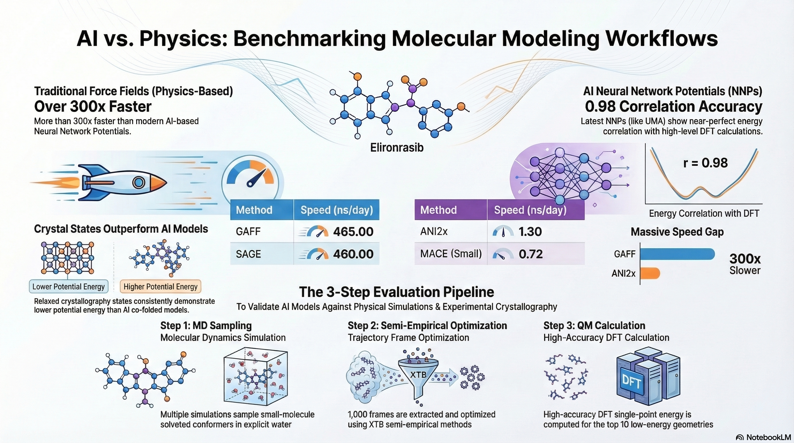

# Evaluating AI-based Molecular Modelling with Physical Simulation

This repository contains the computational workflows and datasets associated with the evaluation of **Machine Learning Force Fields (MLFFs)** and **Atomic Neural Network Potentials (NNPs)** against traditional physical simulation methods. The project primarily focuses on the conformational analysis of the flexible ligand **Elironrasib** across various environments.

 

## Key Research Objectives
*   **Benchmarking Force Fields:** Comparing traditional parameters like **GAFF** and **SAGE** with advanced NNPs such as **ANI2x** and **MACE** to evaluate accuracy and computational performance.
*   **Conformational Sampling:** Exploring ligand folding states, hydrophobic collapse, and atropisomerism using advanced MD techniques including **REST** and **REMD**.
*   **System Parameterization:** Defining **covalent linkages** for KRAS G12C-Elironrasib and managing complex **octahedral coordination** for magnesium cofactors.
*   **Physical Evaluation:** Validating AI-predicted co-folding models (e.g., Boltz-2) against experimental crystallography using total potential energy distributions and binding pose metadynamics.

## Computational Workflow
The project follows a structured three-step pipeline for small-molecule analysis:
1.  **MD Sampling:** Multiple simulations (classic and enhanced) to sample small-molecule solvated conformers.
2.  **Semi-empirical Optimization:** Extraction of frames from trajectories followed by geometry optimization using **XTB**.
3.  **QM Calculation:** Identifying low-energy geometries and computing high-level **DFT** single-point energies to validate findings.

## Software and Tools
The following open-source and academic tools were utilized in this research:
*   **Dynamics & Sampling:** **OpenMM** (GPU-optimized simulation), **GROMACS** (high-performance MD), and **OpenBPMD** (binding pose metadynamics).
*   **Force Fields:** **OpenFF** (SAGE parameterization), **AmberTools** (GAFF setup), and **OpenMM-NAGL** for graph-based charge assignment.
*   **Quantum Mechanics:** **ORCA** (DFT calculations) and **XTB** (semi-empirical optimizations).
*   **Machine Learning Potentials:** **TorchANI**, **MACE**, and **Meta FAIR Chemistry** (fairchem) models.
*   **Analysis:** **MDTraj** for trajectory processing and **pkasolver** for pKa prediction.

## Repository Structure
The repository is organized into several key directories based on the simulation systems:
*   `/binary_complex`: Data and scripts for the Elironrasib-CYPA binary complex.
*   `/ligand_only`: Analysis focused solely on the Elironrasib ligand in solution.
*   `/ternary_complex`: Workflows for the covalent KRAS G12C-Elironrasib-CYPA system.
*   `/images`: Figures and visual data used in the technical analysis.

## Acknowledgements
Research workflow advice, coding assistance, and writing refinement were facilitated by **Google Gemini**. Data and code are hosted across this repository and **Hao Lan's HuggingFace Storage**.
